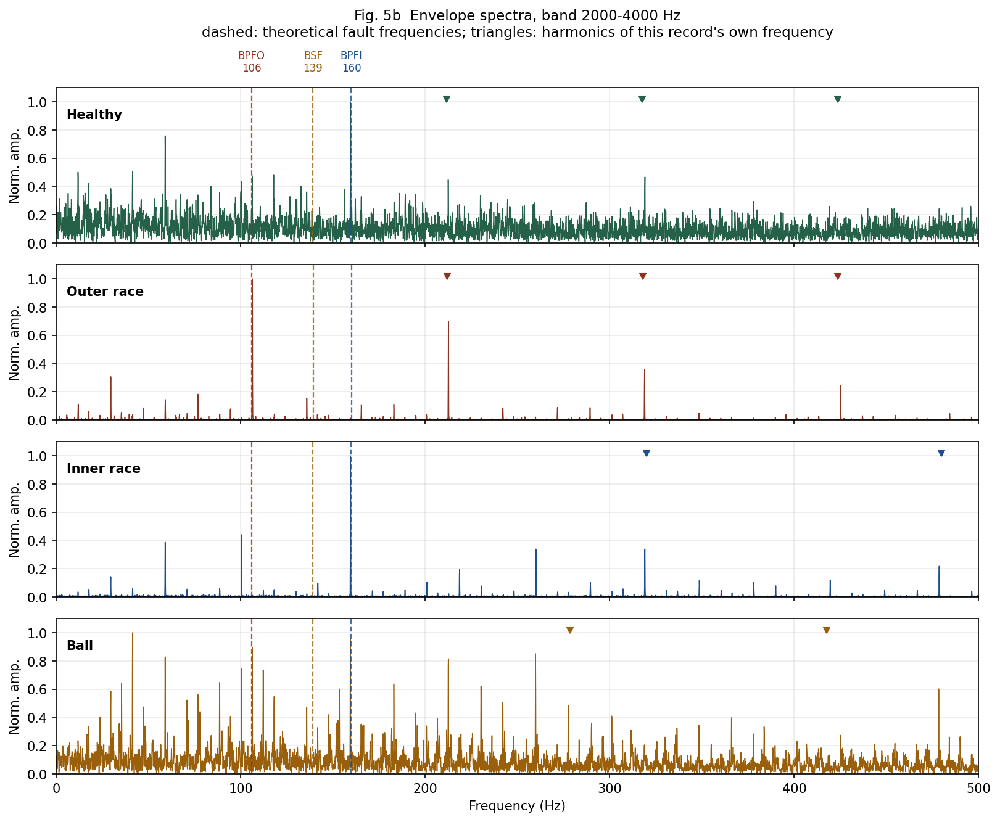
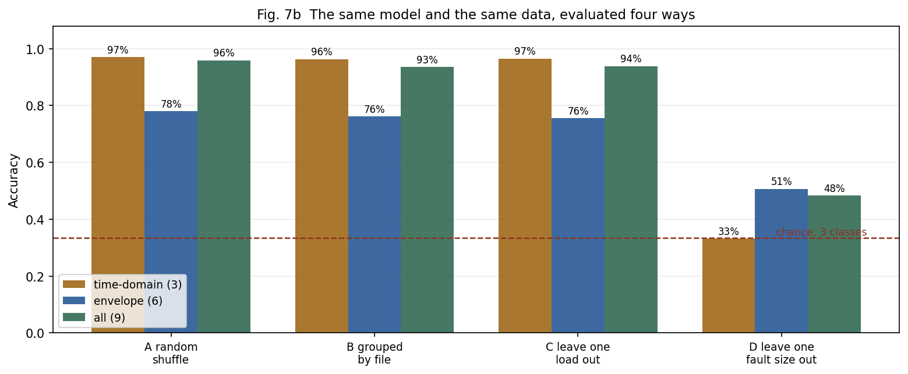

# Diagnosing rolling-element bearing faults from vibration

A rolling element passing over a defect strikes it at a rate the bearing's
geometry predicts. This project measures that rate in real vibration data, and
finds out where the attempt stops working.

Forty records from the [CWRU Bearing Data
Center](https://engineering.case.edu/bearingdatacenter): a healthy baseline
plus outer-race, inner-race and ball faults at three fault diameters, each at
four motor loads. No hardware, no simulated signals.

**[The report (PDF, 20 pages)](report/Bearing_fault_diagnosis_Chengzhe_KONG.pdf)** — the
write-up this repository supports, with every figure below in place and the
failures argued rather than omitted.

## What came out

**The fault frequency is not where a spectrum looks for it.** In the
outer-race record 97.4 % of the energy sits between 2 and 4 kHz and 0.2 %
below 500 Hz, where theory puts the fault frequency. An impact lasting under a
millisecond is broadband; 105.9 Hz is how often it recurs, not what it
contains.

**Envelope analysis recovers it.** Peak-to-background ratios of 635 at BPFO
and 237 at BPFI, measured 0.4 % and 0.25 % from the frequencies geometry
predicts, with harmonics behind the first. The healthy record reaches 9.7 on
the same measurement.



**The resonance band is chosen, not assumed.** Scoring a band by the peak at
the fault frequency needs the answer in advance, so bands are scored on all
three candidate frequencies — which follow from geometry and shaft speed, both
known before any diagnosis — and the best is kept. The decision threshold is
the highest score the *healthy* record reaches over the same search: 11.06,
against a median of 3.57 for any single band. Searching inflates a score, and
a threshold that ignores that manufactures false positives.

**Six of the nine fault records are diagnosed correctly, including diameters
the method was never tuned on. One is a false positive.** The ball fault at
0.021 in clears the threshold at 1.3× and is called an inner-race fault. It
cannot be tuned away: the only marginally correct record sits at 1.2×. So the
rule reports three tiers, and every error falls in the tier that declines to
be certain.

**A classifier's accuracy turns out to depend almost entirely on how the data
is split.** Same model, same features, same records:

| split | accuracy |
|---|---|
| random shuffle | 97.0 % |
| grouped by file | 96.3 % |
| leave one motor load out | 96.5 % |
| **leave one fault diameter out** | **48.3 %** |



On time-domain statistics alone that last figure is 33.1 %, against a chance
level of 33.3 % — not a weak result, no result. Their 96.3 % was a lookup
table over forty tight clusters, and holding out a whole *file* barely dents
it, because the same fault at the same diameter is still in training under
three other loads. On those same unseen diameters the geometry-based rule
above still diagnoses correctly, having never been trained at all.

**The ball fault is never diagnosed, at any diameter.** Its resonance band is
bright but unmodulated: energy without a beat. Detection without diagnosis.

## Three defects in the data, found by checking it

- The healthy baselines are sampled at 48 kHz, which the documentation does
  not state. Read as 12 kHz their entire frequency axis is out by a factor of
  four, silently. Settled by three machine lines that land where a known
  12 kHz record puts them only under the 48 kHz reading.
- File 99 carries a byte-for-byte copy of file 98's channel alongside its own.
  Taking the first variable alphabetically returns file 98's samples under file
  99's name — the same data twice under two labels, across any split.
- File 97 is 5.08 s where every other record is about 10.

All three are now assertions in `src/verify_data.py`, which also compares every
pair of records by hash.

## Reproducing it

```
python -m pip install numpy scipy matplotlib scikit-learn jupyterlab
python src/download_data.py      # fetches the 40 records, about 134 MB
python src/verify_data.py        # the checks above
python -m jupyter lab
```

The records are not in this repository — they belong to the Bearing Data
Center. `src/dataset.py` says what each one is and `src/download_data.py`
brings them back, so every figure here can be regenerated from a clone.

On Windows, `start_jupyter.bat` opens the notebooks in one step.

## Layout

    notebooks/   the seven stages, in order; each ends where the next begins
    src/
      cwru_io.py        reading .mat records, fault frequencies
      dataset.py        the catalogue: what each of the 40 records is
      download_data.py  fetching them
      verify_data.py    the checks, as assertions
      envelope.py       band-pass, Hilbert envelope, band selection
      features.py       segments to rows, for the classifier
    figures/     every figure and table, regenerated by the notebooks
    report/
      FACTS.md     every number with its provenance
      OUTLINE.md   the report's structure
    data/        records land here; FILES.md is the manifest

The notebooks are written in Chinese, as working notes. The code, the figures
and `report/` are in English.

## Stages

| | |
|---|---|
| 01 | waveforms — the outer-race rhythm is countable by eye, about 21 bursts against a predicted 21.2 |
| 02 | RMS, kurtosis, crest factor — detect a fault, cannot name one, and miss the ball fault entirely |
| 03 | the raw spectrum — peaks at the fault frequency, present in the healthy record too |
| 04 | spectrograms — the rhythm, visible; STFT parameters derived from it rather than copied |
| 05 | the envelope spectrum, verified first on a synthetic signal with a known answer |
| 06 | choosing the resonance band, and calibrating a threshold on the healthy record |
| 07 | a classifier, and what its accuracy depends on |
